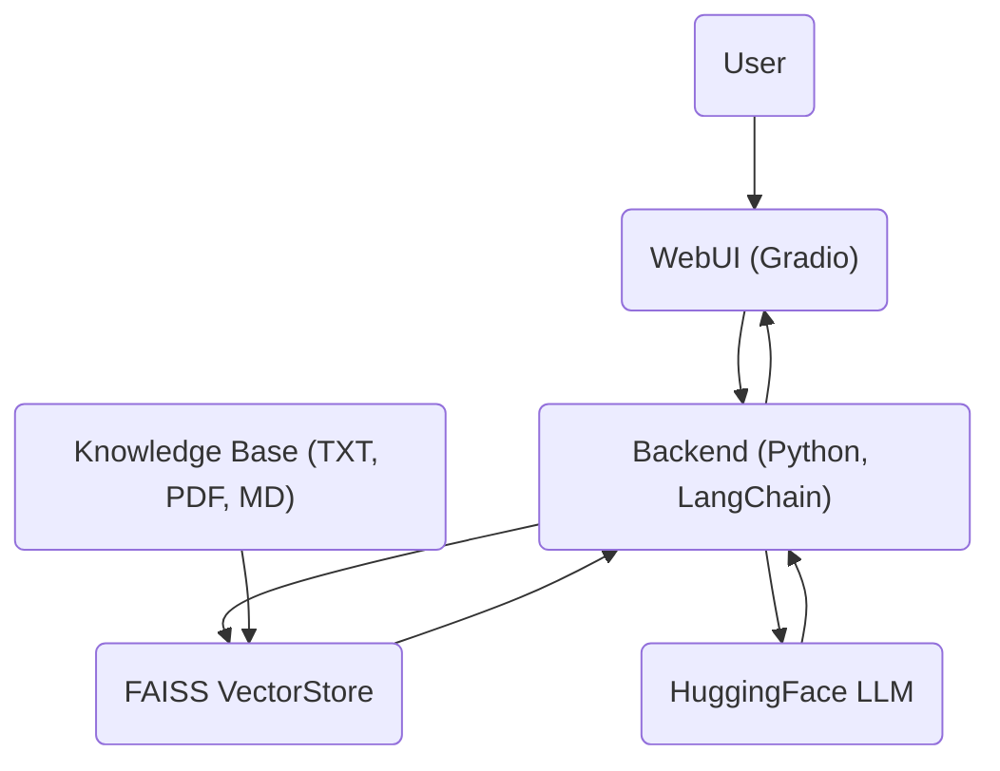

# Project Architecture: Intelligent Knowledge Base Assistant with RAG

## 1. High-Level System Diagram

---

## 2. Environment & Dependencies

- **Python Version:** 3.10+
- **Core Libraries:**
    - `langchain`, `langchain-community`
    - `sentence-transformers`
    - `faiss-cpu` (or `faiss-gpu`)
    - `pypdf` (for PDF support)
    - `tiktoken` (for token counting)
    - `gradio` (for web UI)
    - `transformers` (for LLMs)

---

## 3. Data Ingestion Pipeline

1. **Document Loading:**
    - Uses `DirectoryLoader`, `TextLoader`, `PyPDFLoader` from LangChain.
2. **Text Chunking:**
    - Uses `RecursiveCharacterTextSplitter` with `CHUNK_SIZE` and `CHUNK_OVERLAP` from `config.py`.
3. **Embedding Generation:**
    - Uses `HuggingFaceEmbeddings` with model from `config.py`.
4. **FAISS Indexing:**
    - Uses `FAISS.from_documents`, `save_local`, and `load_local`.

---

## 4. Retrieval & LLM Pipeline

- **Vector Store Loading:** Loads FAISS index and embeddings from config.
- **LLM Loading:** Uses `HuggingFacePipeline` with model from config.
- **Prompt Construction:** Uses a centralized prompt template from `config.py`.
- **Retrieval:** Retrieves top-K relevant chunks (configurable).
- **Answer Generation:** LLM answers strictly from retrieved context; fallback if not enough info.

---

## 5. Web Application (Gradio)

- **UI:** Built with Gradio (`app.py`).
- **Features:**
    - User input box, answer display, sources display, clear button.
    - Only answers from the knowledge base are shown; no hallucinations.
    - Error handling for missing index/model.
- **Config:** All settings (paths, model names, chunk sizes, prompt template) are in `config.py`.

---

## 6. Evaluation & Testing

- **Automated Evaluation:** `evaluate.py` runs the pipeline on a test set and saves results.
- **Manual Review:** Results are annotated and summarized in `EVALUATION.md`.
- **Test Data:** `data/evaluation_data.csv` and `data/evaluation_results.csv`.

---

## 7. Code Structure

- `config.py`: Centralized configuration for all paths, model names, chunk sizes, and prompt templates.
- `ingest_data.py`: Data ingestion and FAISS index creation.
- `rag_pipeline.py`: Core RAG pipeline logic (retrieval, LLM, answer extraction).
- `app.py`: Gradio web application.
- `evaluate.py`: Automated evaluation script.
- `query_assistant.py`: CLI assistant for quick testing/debugging.

---

## 8. Error Handling & Logging

- Uses `try-except` for critical operations (index/model loading, LLM invocation).
- Prints informative error messages; can be upgraded to use Python's `logging` module for production.