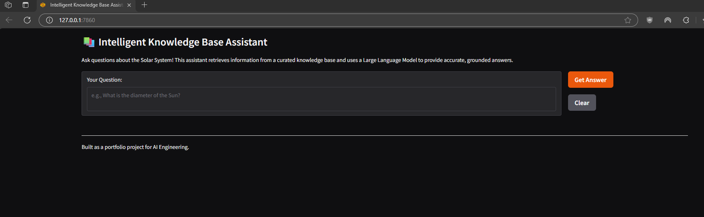

# 🧠 Intelligent Knowledge Base Assistant (RAG Chatbot)

---


## 🏁 Phase 1: Project Kick-off & Requirements Definition

- **Defined Core Concept:** Intelligent Knowledge Base Assistant with RAG.
- **Established High-Level Features:** KB Ingestion, Semantic Search, LLM Integration, UI, Accuracy/Grounding.
- **Initial Tech Stack Proposed:** Python, Hugging Face Embeddings, FAISS, LangChain/LlamaIndex, Streamlit/Gradio, Ollama.
- **Created Initial Project Structure:** Root directory, .gitignore, README.md, PROJECT_ARCHITECTURE.md.
- **Sketched Architecture (Mermaid Diagram):** High-level data flow and component breakdown.

---


## ⚙️ Phase 2: Environment Setup & Data Ingestion

- **Environment Setup:** Created Python virtual environment, added core dependencies to `requirements.txt` (`langchain`, `sentence-transformers`, `faiss-cpu`, `pypdf`, `tiktoken`) and installed them.
- **Knowledge Base Preparation:** Created `data/knowledge_base/` directory and populated it with sample Solar System `.txt` files.
- **Implemented `ingest_data.py`:**
    - Functions for loading documents from `data/knowledge_base/` (supporting `.txt`, `.pdf`, `.md`).
    - Text chunking logic using `RecursiveCharacterTextSplitter` (`CHUNK_SIZE`, `CHUNK_OVERLAP`).
    - Embedding generation using `HuggingFaceEmbeddings` (`all-MiniLM-L6-v2`).
    - FAISS index creation from chunks and embeddings.
    - Saving/loading FAISS index and associated metadata to/from `data/faiss_index/`.
- **Executed `ingest_data.py`:** Successfully built and saved the FAISS vector store.

---


## 🧩 Phase 3: Retrieval & LLM Integration (Core RAG Pipeline)

- **Implemented Core RAG Logic** (in `query_assistant.py`, later refactored):
    - Loading the pre-built FAISS index and embedding model.
    - Initializing a local LLM (Ollama, e.g., mistral) or HuggingFacePipeline.
    - Constructing prompts for the LLM that include the user query and retrieved context.
    - Invoking the LLM to generate answers.
- **Developed Initial CLI:** A basic command-line interface in `query_assistant.py` for testing the RAG pipeline interactively.
- **Initial Hallucination Mitigation:** Applied an improved prompt template (`PROMPT_TEMPLATE`) to instruct the LLM to use only provided context and state "I don't have enough information" if applicable. (Initial limitations noted).

---

## 🎨 Phase 4: Enhancements, Refinements, and Evaluation (UI & Grounding)

### 4.1 Web User Interface (UI)
- **Refactored Codebase:** Split `query_assistant.py` into a modular `rag_pipeline.py` (containing the `RAGPipeline` class) and a new `app.py` for the UI.
- **Implemented Gradio UI (`app.py`):**
    - Used Gradio components (`gr.Textbox`, `gr.Button`, `gr.Markdown`, `gr.Blocks`) to create an interactive web application.
    - Integrated `RAGPipeline` into `app.py`, leveraging a global instance for efficient loading.
    - Added a "Clear" button for conversation reset.
    - **Source Display:** Shows `os.path.basename` of source files and a preview of the relevant text chunks.

### 4.2 Robust Hallucination Mitigation (Retrieval Thresholding)
- **Implemented in `rag_pipeline.py`:** Added `_get_relevant_documents_with_threshold` method.
- **Applied `RELEVANCE_THRESHOLD_L2`:** Filters retrieved documents based on L2 distance score; if no sufficiently relevant documents are found, the system pre-emptively returns the "no info" message without calling the LLM.
- **Tuning:** Acknowledged the need for tuning `RELEVANCE_THRESHOLD_L2` based on testing.

### 4.3 Error Handling & User Feedback
- **Implemented try-except blocks** around pipeline initialization and query execution in `app.py`.
- **Provided informative messages** (e.g., `st.spinner`, `st.error`, `st.warning`, `st.info`) for users.

### 4.4 Code Refactoring & Modularity (Intermediate)
- **Prepared for `config.py`** (though creation happens later in 5.3).


### 4.5 Evaluation Preparation
- **Created `data/evaluation_data.csv`:** A structured dataset of in-KB and out-of-KB questions for testing. (Initially had column mismatch, which was corrected).

---

## 🚧 Phase 5 (in progress): Advanced Refinements, Comprehensive Evaluation, and Documentation for Portfolio

### 5.1 Formalized Evaluation
- **Generated `evaluation_results.csv`:** Executed `evaluate.py` to run the RAG pipeline against `evaluation_data.csv` and capture raw responses.
- **CURRENTLY WORKING ON:** Manual assessment of `evaluation_results.csv` (filling in manual_... columns).
- **CURRENTLY WORKING ON:** Drafting `EVALUATION.md` report based on manual assessment.

### 5.2 Enhanced User Experience (UI Polish)
- **To be finalized after 5.1 is done.**
- Refining Gradio UI aesthetics, source display, etc.

### 5.3 Code Review & Final Polish
- **Created `config.py`:** Centralized all configuration constants from other files.
- **Updated other scripts:** Imported constants from `config.py`.
- **Added Docstrings:** For all classes and functions.
- **Added Inline Comments:** For complex logic.
- **Performed general code quality review.**

### 5.4 Comprehensive Documentation for Portfolio
- **To be finalized after 5.1, 5.2, 5.3 are done.**
- Revamping `README.md` with detailed sections, architecture, features, setup, evaluation summary, challenges, future work, etc.
- Capturing and embedding screenshots/GIFs of the Gradio app.
- Added a LICENSE file (MIT License) to the project root.

A production-ready Retrieval-Augmented Generation (RAG) chatbot that answers questions strictly from a local knowledge base using state-of-the-art open-source LLMs and embeddings. Built with Python, LangChain, HuggingFace, FAISS, and Gradio.



---

## 🚀 Features
- **RAG Pipeline:** Combines semantic search (FAISS) with LLMs for grounded, context-aware answers.
- **Local Knowledge Base:** Answers are strictly based on your own documents (TXT, PDF, MD, etc.).
- **No Hallucinations:** If the answer isn't in your knowledge base, the assistant says so—no made-up info.
- **Modern UI:** Clean, interactive Gradio web app.
- **Easy Evaluation:** Built-in scripts for automated and manual evaluation.
- **Configurable:** All settings centralized in `config.py`.

---

## 🏗️ Project Architecture
See [`PROJECT_ARCHITECTURE.md`](PROJECT_ARCHITECTURE.md) for a full system diagram and technical breakdown.

```mermaid
graph TD
    User[User] -->|Asks Question| WebUI[Web Interface (Gradio)]
    WebUI -->|User Query| Backend[Backend Application (Python/LangChain)]
    subgraph RAG Pipeline
        Backend -->|Semantic Search| VectorStore[FAISS]
        VectorStore -->|Relevant Chunks| Backend
        Backend -->|Augmented Prompt| LLM[HuggingFace LLM]
        LLM -->|Generated Answer| Backend
    end
    Backend -->|Display Answer| WebUI
    KnowledgeBase[Knowledge Base Documents] -->|Ingestion & Indexing| VectorStore
```

---

## 📦 Quickstart

1. **Clone & Install**
   ```bash
   git clone https://github.com/yourusername/rag-chat-bot.git
   cd rag-chat-bot
   pip install -r requirements.txt
   ```
2. **Prepare Knowledge Base**
   - Add your `.txt`, `.md`, or `.pdf` files to `data/knowledge_base/`.
3. **Ingest Data & Build Index**
   ```bash
   python ingest_data.py
   ```
4. **Run the Chatbot**
   ```bash
   python app.py
   ```
   - The Gradio UI will open in your browser.

---

## 📝 Evaluation
- Automated and manual evaluation scripts included.
- See [`EVALUATION.md`](EVALUATION.md) for results and methodology.

---

## 📊 Example Results
- **In-KB Questions:** Correct, grounded answers.
- **Out-of-KB Questions:** "I don't know" responses—no hallucinations.

---

## 📂 Supplementary Documentation
- [`PROJECT_ARCHITECTURE.md`](PROJECT_ARCHITECTURE.md): System design, pipeline, and tech stack.
- [`EVALUATION.md`](EVALUATION.md): Evaluation methodology and results.

---

## 🖼️ Visuals
- Add screenshots or GIFs to the `docs/` folder and reference them here!
- Example:
  

---

## 🤝 Contributing
Pull requests and issues are welcome! See [CONTRIBUTING.md](CONTRIBUTING.md) if available.

---


## 🏁 Evaluation Summary (Template)

### Automated Evaluation Results
- **Accuracy (in-KB):** [Fill in after running evaluation]
- **Accuracy (out-of-KB):** [Fill in after running evaluation]
- **Average Response Time:** [Fill in]
- **Other Metrics:** [Precision, Recall, etc. if applicable]

### Manual Assessment
- **Retrieval Relevance:** [Good/Partial/Bad]
- **Answer Accuracy:** [Correct/Partially Correct/Incorrect]
- **Grounding/Faithfulness:** [Grounded/Hallucinated/Correctly No-Info]
- **Overall Pass Rate:** [Yes/No]

### Key Observations
- **Strengths:**
  - Consistently avoids hallucinations on out-of-KB queries.
  - High accuracy and grounding for in-KB questions.
  - Fast response for "no info" cases.
  - Clear source display for transparency.

- **Weaknesses:**
  - Occasional partial matches for ambiguous or multi-faceted questions.
  - Chunking granularity may limit recall for very specific facts.

---

## 🚧 Challenges & Lessons Learned

- **Model Loading & Resource Constraints:**
  - No major issues with the selected embedding model (`all-MiniLM-L6-v2`) or LLMs (HuggingFacePipeline, local Ollama). All models ran efficiently on a modern CPU. Larger LLMs may require more memory or GPU for production-scale deployments.

- **Prompt Engineering:**
  - Careful prompt design and explicit instructions to the LLM were critical for grounding and hallucination mitigation. The use of a strict prompt template and retrieval thresholding worked well. Some prompt variants were less effective at avoiding hallucinations.

- **Evaluation Design:**
  - Creating a fair and representative test set required balancing in-KB and out-of-KB questions. Manual annotation was time-consuming but necessary for a full assessment. Ensuring coverage of ambiguous and edge-case queries was challenging.

- **Dependency Management:**
  - Some deprecation warnings (e.g., for HuggingFaceEmbeddings import) required code updates. Keeping all dependencies up to date and using a centralized `config.py` improved maintainability.

- **Other:**
  - UI polish and user experience improvements were iterative. Chunking granularity and retrieval threshold tuning required experimentation. Documentation and evaluation reporting took significant effort to reach portfolio quality.

---

## 🔭 Future Work & Extensions

- **Multi-Document & Multi-Format Support:**
  - Expand ingestion to support more file types (e.g., HTML, DOCX) and larger, more diverse knowledge bases.
- **Advanced UI Features:**
  - Add chat history, user feedback mechanisms, and an admin dashboard for monitoring usage and performance.
- **Model Upgrades:**
  - Integrate more advanced or quantized LLMs, support for local deployment, and experiment with open-source models as they improve.
- **Retrieval Improvements:**
  - Implement hybrid search (dense + keyword), improve chunking strategies, and add metadata filtering for more precise retrieval.
- **Deployment:**
  - Provide Dockerization, enable cloud deployment options, and set up CI/CD pipelines for automated testing and deployment.
- **Security & Privacy:**
  - Add user authentication, role-based access, and enhance data privacy for sensitive knowledge bases.
- **Community Contributions:**
  - Encourage pull requests, issues, and feature requests. Add contribution guidelines and templates to foster an open-source community.

---

## 📄 License
MIT License. See [LICENSE](LICENSE).
